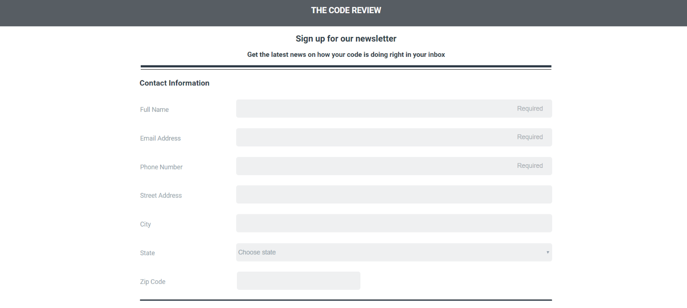

<h1>Project 3 in Techdegree. Treehouse Responsive Form</h1>
 

In this project, I build a responsive, mobile-friendly registration form using a wide variety of HTML form input types and attributes. Using the supplied mockup files, I build a mobile and desktop version of the form using media queries, and a "mobile-first" approach.

 
<h2>Live Demo</h2>

 
<h3>Skills</h3>
<ul>
  <li>HTML Input Types</li>
  <li>CSS</li>
  <li>Media Queries</li>
  <li>Testing and debugging</li>
</ul>
 
<h3>Conclusion</h3>

This project gave me overview and skills to build a beautiful and responsive form. The form is adjusted with the width of layout and has some effects when the user hover the form field. I also practice the importance to use input types properly to get the information and data from the users.
.
